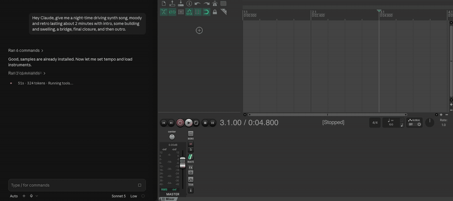

# rondo

[](https://github.com/aarontimko/rondo/actions/workflows/ci.yml)
[](https://github.com/aarontimko/rondo/releases/latest)
[](#license)



A small stdlib toolkit that lets an LLM drive Reaper, so you can make music by
talking. You describe a part in words, and one script per task writes the notes,
loads the instrument, copies the section or renders the bars, into the project
you already have open.

That is the whole workflow. After the one-time setup below, the prompt can be as
plain as "Hey Claude, give me a night-time driving synth song, moody and retro,
lasting about 2 minutes, with an intro, some building and swelling, a bridge,
a final closure and an outro." The clip above is a smaller model (Sonnet) working
from exactly that; two or three minutes later there is a song with named
sections, instruments and automation in your Reaper project, ready to play,
edit and keep.

The conversation carries on from there. "I don't like the bridge, give me five
alternates" puts five variations on muted tracks so you can unmute each and
compare; "keep number three and delete the rest" promotes the winner. "Make the
pad swell into the chorus", "try a key change in the bridge", "save this as
take two and try a faster tempo" are all the same loop: you say what you hear,
the scripts change the project, and you listen again.
[`docs/tutorial.md`](docs/tutorial.md) walks through one whole session that way,
and the [theme song](https://github.com/aarontimko/rondo/releases/download/v0.1.0/rondo-theme-song.mp3) on the Releases page is that demo song after an
hour of getting the volumes right: three and a half minutes, two plucks, a pad
and drums.


## Who it is for

* You want to make music by describing it, and you have a Mac with Reaper
  installed.
* You are a programmer or an LLM-tool user who would rather type "give me a
  night-drive bass line" than learn to draw one in a piano roll.
* You want the result to live in a real DAW project you can open, edit and keep,
  not inside a service.
* You like correcting a part in words, "the walk down is separate notes, not
  held", and hearing the fix a second later.

## Who it is not for

* You already work fluently in a DAW and want a plugin inside it. rondo is a set
  of command-line scripts outside Reaper, not a window in it.
* You want a finished track generated from a prompt as audio. rondo writes MIDI,
  instruments and automation; the sound comes from synths on your machine.
* You are on Windows or Linux. The bridge and the instrument paths are Mac-only
  today.
* You want rondo to press play. It sets a track up and stops; the transport
  stays yours.

## What it does

* **Reads the open project first.** `status.py` prints the tempo, every track
  with its FX and item count, the regions and the cursor, so the model looks
  before it acts.
* **Loads instruments by name.** `add_instrument.py` finds or creates a track
  and puts Surge XT, Dexed or the Apple GM piano on it, with a patch if you name
  one, and renames the track to `Role (Instrument: Patch)` so the track list says
  what makes each sound.
* **Writes melodies from readable text.** `write_notes.py` takes the bar-per-line
  grid format, or JSON notes, and writes them onto a track at a bar.
* **Builds a drum kit from one-shots.** `build_kit.py` puts one
  ReaSamplOmatic5000 per note on a single track from a manifest;
  `install_samples.py` fetches the CC0 VCSL samples it names.
* **Draws automation.** `automate.py` draws a volume or FX-parameter envelope
  over a bar range, reads envelopes back, or clears them.
* **Arranges by section.** `copy_section.py` copies bars X..Y to bar Z across
  tracks and can name the result as a region; `project.py` sets the tempo, names
  regions and markers, moves the cursor and saves tabs by name.
* **Records and renders.** `record.py` arms a track for the mic or the virtual
  keyboard; `render.py` renders a bar range or a named region to a wav, with no
  dialog; `hum_to_grid.py` turns a hummed take into grid text.
* **Small moves.** `track.py` mutes, solos, arms, renames, deletes and sets
  volume one track at a time; `run_lua.py` runs any ReaScript inside the
  running Reaper and prints its output.
* **Stays small.** One script per task, stdlib only, no server of its own, and
  `--json` wherever machine output helps.

## Install

```sh
git clone https://github.com/aarontimko/rondo.git
cd rondo
python scripts/status.py --help
```

Python 3.11 or newer, and nothing else: every script is stdlib. Only
`hum_to_grid.py` needs third-party packages, and only if you use it:

```sh
uv pip install -e '.[transcribe]'
```

You also need Reaper running on macOS with a project open, the instruments you
want to load (Surge XT and Dexed are free), and the bridge script loaded once per
Reaper launch. The bridge is `reaper_mcp_bridge.lua` from
[TwelveTake's reaper-mcp](https://github.com/TwelveTake-Studios/reaper-mcp)
(MIT), a ReaScript that reads requests from a folder and runs them inside Reaper.
rondo does not ship it; install it into Reaper's `Scripts` folder with the
upstream installer, then load it:

```sh
uvx twelvetake-reaper-mcp --install-bridge
open -a REAPER ~/"Library/Application Support/REAPER/Scripts/reaper_mcp_bridge.lua"
```

If the bridge is not answering, every script that needs Reaper says so and
prints the load command.

First run, in order:

1. Install Python 3.11 or newer and [uv](https://docs.astral.sh/uv/); macOS
   ships an older `python3`, so `uv python install 3.12` is the short way.
2. Install Reaper, Surge XT and Dexed.
3. Install the bridge with the `uvx` command above.
4. Start Reaper and open a project (a new empty one is fine).
5. Load the bridge with the `open -a REAPER` command above.
6. `python3 scripts/status.py` should print the tempo and the empty track list.
7. `python3 scripts/install_samples.py` once, before the first `build_kit.py`.

The docs write `python`; use `python3` if that is what your shell has.

## Use it

The loop is always the same: look, act, listen.

```sh
python scripts/status.py                                    # look
python scripts/add_instrument.py --track Pad --instrument surge --patch "Bell Pad"
python scripts/write_notes.py --track Pad --bar 1 --grid pad.txt --replace
python scripts/render.py --from 1 --to 8 --out /private/tmp/take.wav   # listen
```

`--help` always tells the truth, and `AGENTS.md` is the orientation an LLM reads
first: the golden path, the full task table, and the rules about track names and
project tabs.

* [`docs/tutorial.md`](docs/tutorial.md): one jam from a recorded take to
  versioned clones of the project.
* [`docs/grid-format.md`](docs/grid-format.md): the bar-per-line melody notation,
  with worked examples.
* [`docs/reaper-notes.md`](docs/reaper-notes.md): what this machine's Reaper
  actually does, verified, including the traps.

## Status

`v0.1.0` is the first release: the scripts as a tagged source tree, on the
Releases page. Expect the script flags, the grid format and the track naming
convention to move between minor versions until 1.0, with everything that moves
written down in `CHANGELOG.md`, and `git pull` to carry a clone forward.

Bug reports and small fixes are welcome. A feature wants an issue before a pull
request, so the shape can be agreed before anyone writes it.

I built rondo by directing coding agents against written specifications, with an
adversarial review before every merge.

## Contributing, security, issues

Read [`CONTRIBUTING.md`](CONTRIBUTING.md) before your first pull request; it has
the setup, the test commands CI runs, and the commit conventions.
[`SECURITY.md`](SECURITY.md) is how to report a vulnerability privately, which is
never a public issue. [`CODE_OF_CONDUCT.md`](CODE_OF_CONDUCT.md) applies to
everyone taking part. Open a bug or a feature request through the issue chooser,
and take questions and ideas to Discussions.

## License

Apache-2.0. See [`LICENSE`](LICENSE).
